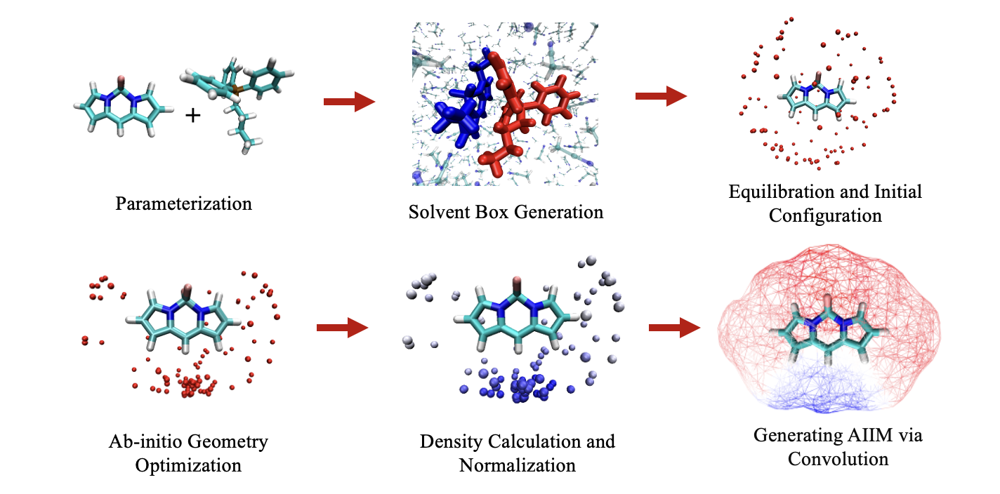

# Automatic Protocol for Ab-Initio-Interaction-Map

## Overview

This project provides an automated protocol for generating Ab-Initio Interaction Maps (AIIM) using Python and Shell scripting. By following this protocol, users can efficiently compute a 3D interaction map between two molecules from their XYZ coordinates, which is crucial for identifying the sites where the molecules are most likely to interact with each other. The figure represents stepwise workflow for generating AIIM map for BODIPY and TPAB molecules. The blue regions on the Vander Waals surface of BODIPY indicates TPAB molecule most likely to interact with the BODIPY. By following this protocol, one can generate AIIM maps for any two molecules.

The process involves several steps, including setting up a virtual environment, installing necessary dependencies, running the main script to generate a solvent box, equilibration and initial configuration, geometry optimization, and AIIM generation via convolution. These steps are designed to streamline the workflow and provide a comprehensive solution for AIIM generation.

## Authors

Mohammad Pabel Kabir, Fang Liu

## Requirements

> AMBER16 or above 

> Packmol (https://m3g.github.io/packmol/)

> WHAM (http://membrane.urmc.rochester.edu/content/wham)

## Installation of Requirements

### Step 1: Create a Virtual Environment

Install virtualenv if you don't have it: python2.7 -m pip install virtualenv

Create a virtual environment: python2.7 -m virtualenv vdw_surface

Activate the virtual environment: source vdw_surface/bin/activate

### Step 2: Download and Install pyvdwsurface

Install Cython: python -m pip install cython

Clone the pyvdwsurface repository (optional: you can clone it in any folder): git clone https://github.com/rmcgibbo/pyvdwsurface.git

cd vdw_surface

cd pyvdwsurface

Install pyvdwsurface: python -m pip install .

### Step 3: Install Dependencies

Install NumPy: python -m pip install numpy

Install Matplotlib: python -m pip install matplotlib

## Workflow Description

### Step 1: Van der Waals (vdW) surface points generation

Place your XYZ coordinate file (Project.xyz) in the same directory as the script (1.vdw_surface.py). The file should be formatted as follows:

Number of atoms

Comment line

Atom1 x1 y1 z1

Atom2 x2 y2 z2
...

Ensure you have the following files in your working directory:

vdw_surface.py (the main script)

Your XYZ file (e.g., Project.xyz)

Run the script: python 1.vdw_surface.py

The script will generate the points of the surface in two formats:

pointsXx.txt: Contains the points with atomic label Xx.

points.txt: Contains the raw coordinate points on the vdW surface.

### Step 2: Gaussian Input Generation

Prepare a project.com file containing methods, basis sets, and the molecule XYZ (sample input file is given in example directory: project.com).

Run 2.gaussian_input.sh to generate all the Gaussian input files.

### Step 3: Job Submission

Modify the 3.gaussian_sub.sh script based on the total number of .com files.

Run 3.gaussian_sub.sh to submit all the jobs.

### Step 4: Data Collection

Run 4.data_collection.sh to collect all the data from the expected excited state.

### Step 5: Generation of .mol2 File

Run 5.estm.sh to generate a sample.mol2 file, which can be opened with a visualization software like VMD.

## Getting Started

To begin using this workflow, clone the repository and navigate to the root directory. Ensure that all required Python libraries (`NumPy`, `Cython`, `pyvdwsurface`, etc.) are installed. Follow the steps outlined in the README files within each directory to execute the workflow successfully.

## Contributions

Contributions to this workflow are welcome. If you have suggestions for improvement or encounter any issues, please feel free to open an issue or submit a pull request.

## License

This project is licensed under the MIT License. See the [LICENSE](LICENSE.md) file for more details.
